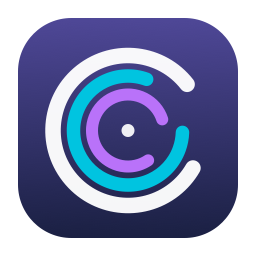
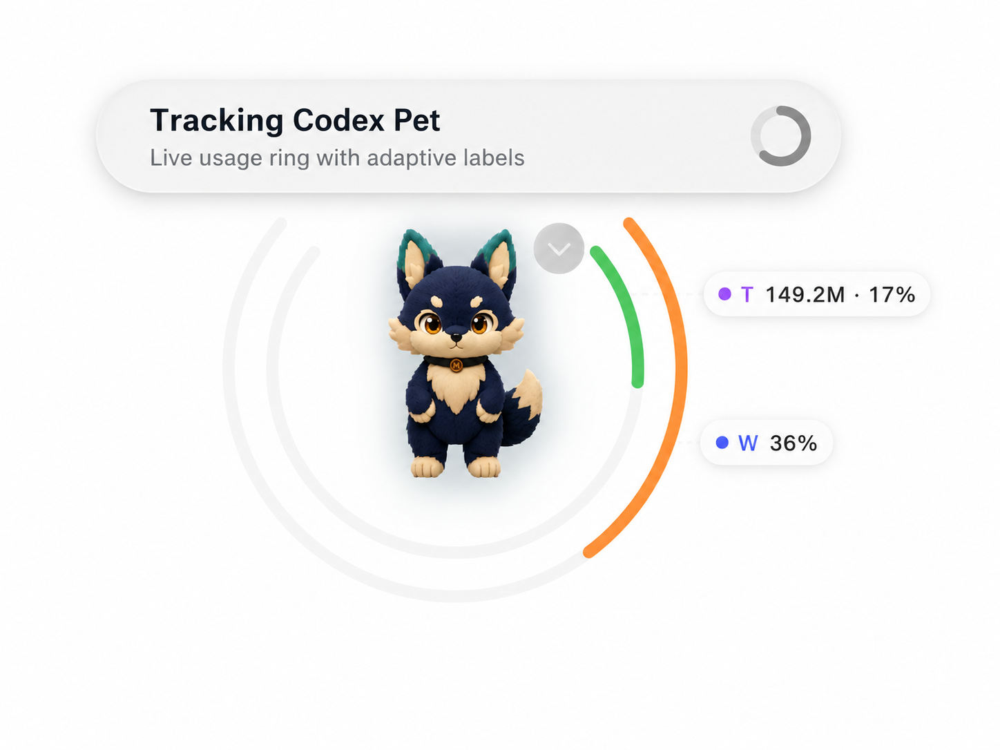
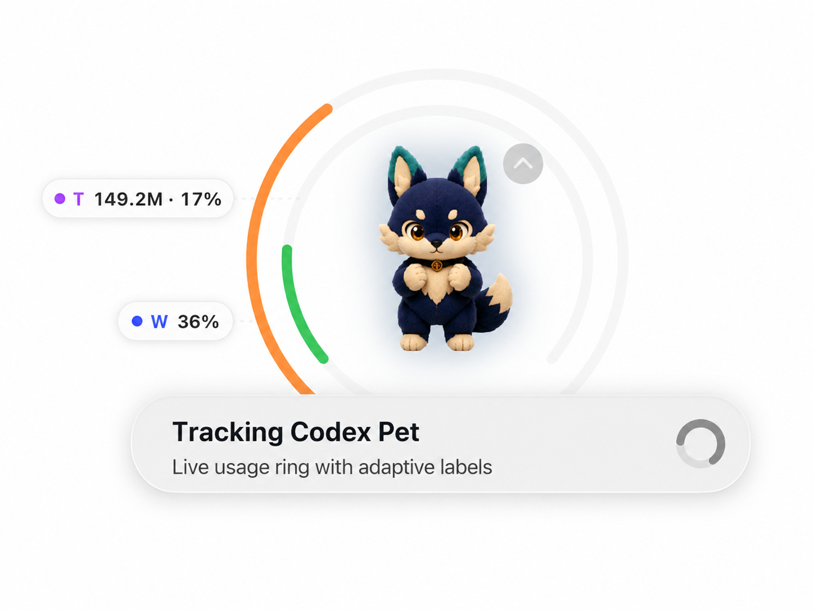

# Pet Halo for Codex

<p align="center">
  
</p>

Pet Halo is a macOS menu-bar companion that places a transparent Usage ring around Codex Pet, with safe Codex-window and free-floating fallbacks.

[](https://github.com/jianshi-codes/codex-pet-halo/releases/tag/v0.1.0-beta.1)
[](https://github.com/jianshi-codes/codex-pet-halo/actions/workflows/ci.yml)
[](LICENSE)


> **Unofficial project:** Pet Halo is independent and is not affiliated with, endorsed by, or supported by OpenAI. Codex and Codex Pet are OpenAI products.

## Preview

<table>
  <tr>
    <td width="50%" align="center">
      
    </td>
    <td width="50%" align="center">
      
    </td>
  </tr>
  <tr>
    <td align="center">Activity above · labels on the right</td>
    <td align="center">Activity below · labels on the left</td>
  </tr>
</table>

Codex Pet is shown only to demonstrate integration. It is not Pet Halo project branding.

## What the rings mean

- **Outer ring — Weekly remaining:** the remaining percentage for the exact 10,080-minute Codex rate-limit window. When Codex provides its reset timestamp, the capsule also shows that date in the user's local timezone, for example `W 39% · Jul 27`.
- **Middle ring — optional 5h remaining:** the remaining percentage for an exact 300-minute window. It is omitted when Codex does not provide one.
- **Inner ring — Today versus historical peak:** tokens in the current Codex UTC account day divided by the highest nonzero historical daily token count supplied by Codex. Missing or ambiguous data is omitted, never estimated as zero.

Weekly and 5h remaining use these status thresholds:

- healthy: `>= 50%`;
- warning: `20%` through `49%`;
- critical: `< 20%`.

Today versus historical peak uses the opposite direction:

- healthy: `<= 50%`;
- warning: `> 50%` through `80%`;
- critical: `> 80%`.

**Status color does not identify the metric.** The `W`, `5h`, and `T` capsule text and their fixed identity dots identify Weekly, five-hour, and Today. Today is not a quota: `T 10%` means today’s usage is 10% of the historical peak day, not 90% remaining.

Weekly and 5h use independent rate-limit freshness. Today uses independent Account Usage freshness, so a successful rate-only refresh cannot make stale Today data current.

## Download

[Download Pet Halo v0.1.0-beta.1 from its tag-specific GitHub Release page.](https://github.com/jianshi-codes/codex-pet-halo/releases/tag/v0.1.0-beta.1)

> **Unsigned preview warning:** `Pet-Halo-0.1.0-beta.1-unsigned-universal.zip` is unsigned and not notarized by Apple. It is not a Developer ID release, and macOS may block its first launch. Only override Gatekeeper after independently verifying the GitHub source, release checksum, and repository provenance.

Before downloading, confirm the installed CLI version:

```sh
codex --version
```

Only the exact reviewed CLI version in the compatibility table is currently accepted. Unsupported or unparseable versions fail closed before Pet Halo launches its owned app-server.

## Supported Codex versions

| Component | Supported version | Scope |
| --- | --- | --- |
| Codex CLI | `0.145.0-alpha.18` | Read-only Usage bridge and reviewed production protocol semantics |
| Codex Desktop | `26.715.31925 (5551)` | Previously validated Pet Accessibility geometry |
| Codex Desktop | `26.715.52143 (5591)` | Current M9 Route A and complete Pet-following gate validated |

A version is added only after initialize, account, rate-limit, Account Usage, notification, and JSON-RPC semantics have been reviewed—not merely because decoding succeeds. See [Compatibility](docs/COMPATIBILITY.md).

### System requirements

- macOS 14.0 or later;
- Apple silicon or Intel Mac (`arm64` and `x86_64` are included in the ZIP);
- Codex Desktop installed for Pet or window following;
- the exact supported Codex CLI installed and signed in for Usage data;
- Accessibility permission only if you enable following.

## Installation and first run

1. Download `Pet-Halo-0.1.0-beta.1-unsigned-universal.zip`, `SHA256SUMS`, `release-manifest.json`, and `RELEASE_NOTES.md` from the [Beta 1 Release](https://github.com/jianshi-codes/codex-pet-halo/releases/tag/v0.1.0-beta.1).
2. In the directory containing all four assets, verify the archive, manifest, and release notes:

   ```sh
   shasum -a 256 -c SHA256SUMS
   ```

3. Extract the ZIP and move **Pet Halo.app** to Applications.
4. Start Codex Desktop and make Pet visible.
5. Open Pet Halo. It appears in the menu bar and does not create a Dock app or normal window.
6. Confirm the menu says `Usage: Connected`. If it does not, use the troubleshooting table below.
7. Select **Enable Pet Following** only when you want Pet Halo to request Accessibility access.

Usage display does not require Accessibility. Following does. Do not bypass Gatekeeper for an artifact presented as signed/notarized that fails verification.

## Accessibility and following

Pet Halo uses macOS Accessibility only after an explicit enable action. It inspects the exact `com.openai.codex` application and only role/subrole, minimized/hidden state, position, size, and geometry/lifecycle notifications needed to identify and follow Pet or the standard Codex window.

It does not read titles, labels, document text, prompts, responses, conversation content, or selected text. It does not use Screen Recording, screenshots, or OCR. If permission is denied or revoked, Usage remains available and following fails closed.

To enable following:

1. Choose **Enable Pet Following** from the Pet Halo menu.
2. Grant Pet Halo access in **System Settings → Privacy & Security → Accessibility**.
3. Return to Pet Halo. A unique visible Pet is preferred automatically.

Target priority is Pet, then an explicitly calibrated Codex standard-window fallback, then free-floating placement. Ambiguous Pet geometry is never guessed. When Pet is tucked away or unavailable, Pet Halo hides by default; **Use Codex Window Fallback** restores the calibrated card, and Wake returns to a unique supported Pet target.

### Adjust Ring Center

When Pet is selected, choose **Adjust Ring Center**. Drag the Ring or use the four-point nudge commands, then choose **Save Ring Center**. **Cancel** restores the prior value and **Reset Visual Center** returns to zero offset.

This setting moves the complete Ring surface by one bounded local offset. It does not change Pet discovery or persist Pet coordinates.

## Privacy

Pet Halo launches one owned local `codex app-server --stdio` child and makes only read-only account/rate-limit/Usage requests. It stores no account identity or Usage data, makes no direct network request, and includes no telemetry, analytics, crash upload, updater, or cloud service. Local preferences contain only following enablement, a Codex-window anchor, and the bounded Ring visual-center offset.

See [Privacy](docs/PRIVACY.md) and [Security](SECURITY.md).

## Troubleshooting

| Menu state | What it means | Safe next step |
| --- | --- | --- |
| `Usage: Codex CLI not found` | No supported executable was found | Install or repair the Codex CLI, then relaunch Pet Halo |
| `Usage: Unsupported Codex CLI version` | The detected CLI has not passed semantic review | Check the compatibility table and file a sanitized compatibility report |
| `Usage: Sign in to Codex` | Authentication is unavailable | Sign in through Codex, then refresh Usage |
| `Usage: Rate limits temporarily unavailable` | The read-only rate snapshot failed | Wait and use **Refresh Usage**; no value is estimated |
| `Usage: Today temporarily unavailable` | Account Usage is unsupported or temporarily failed | Weekly may remain current; Today stays omitted/unavailable |
| `Following: Codex Not Running` | Codex Desktop is not available | Start Codex Desktop |
| `Following: Accessibility Required` | Permission is absent or was revoked | Re-enable Pet Halo in Accessibility settings |
| `Pet: Unavailable or Tucked Away` | No supported visible Pet target exists | Wake Pet, or use the Codex window fallback |
| `Pet: Target Ambiguous` | More than one eligible target remains | Tuck Away/Wake Pet; Pet Halo will not guess |

Public issue reports must not contain raw protocol payloads, tokens, account identity, conversation content, executable paths, raw Accessibility errors, or private screenshots. Follow the [sanitized compatibility-report instructions](docs/COMPATIBILITY.md#sanitized-compatibility-reports).

## Uninstall

1. Quit Pet Halo.
2. Move **Pet Halo.app** to Trash.
3. Optionally remove its local UI preferences:

   ```sh
   defaults delete io.github.jianshicodes.PetHalo
   ```

4. Optionally remove Pet Halo from **System Settings → Privacy & Security → Accessibility**.

No Usage database, account cache, updater, or background service is installed.

## Build from source

Xcode 26.4.1, Swift 6.3.1, and XcodeGen 2.46.0 are the current reviewed toolchain. `project.yml` is the editable Xcode project source of truth.

```sh
make bootstrap
make check
make release-unsigned-preview MARKETING_VERSION=0.1.0 BUILD_NUMBER=2 RELEASE_TAG=v0.1.0-beta.2
```

The unsigned preview target requires a clean source tree and produces `Pet-Halo-0.1.0-beta.2-unsigned-universal.zip`. Developer ID signing and Apple notarization remain separate credentialed steps described in the [Release checklist](docs/RELEASE_CHECKLIST.md). The Download section continues to point to the currently published Beta 1 release until Beta 2 is separately reviewed and published.

## Contributing and security

Read [Contributing](CONTRIBUTING.md), the [Code of Conduct](CODE_OF_CONDUCT.md), and the [Security Policy](SECURITY.md). Contributor/operator references include [GitHub settings](docs/GITHUB_SETTINGS.md), the [public-exposure audit](docs/PUBLIC_EXPOSURE_AUDIT.md), and the [release checklist](docs/RELEASE_CHECKLIST.md). Architecture decisions, compatibility evidence, and milestone reports remain under [`docs/`](docs/).

## License

MIT. See [LICENSE](LICENSE).
