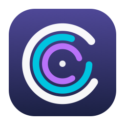
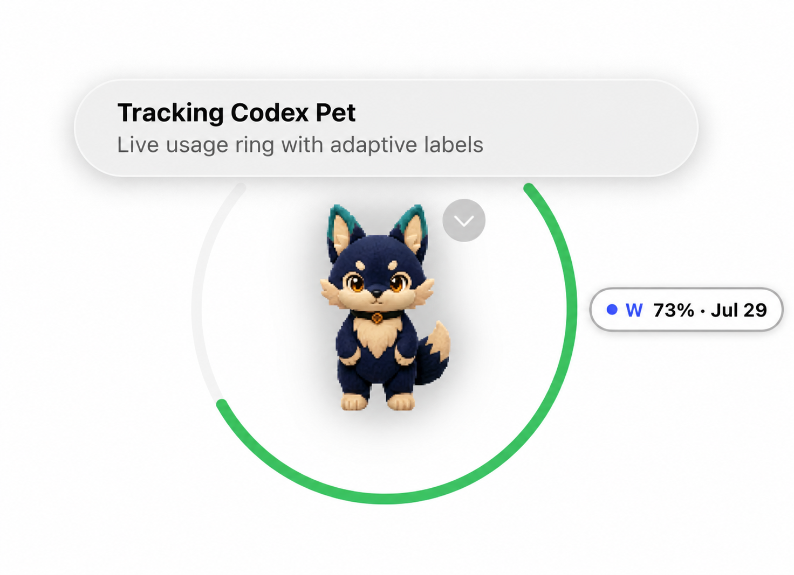
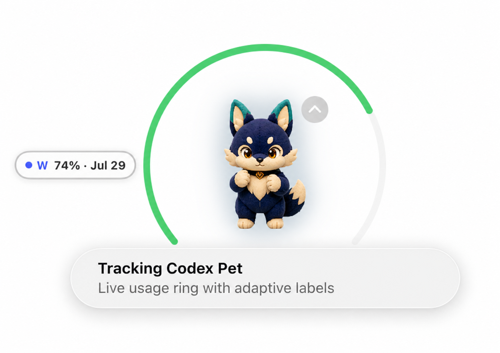

# Pet Halo for Codex

  

Pet Halo is an unofficial macOS menu-bar companion that shows Codex Usage around Codex Pet. It can fall back to the Codex window or a free-floating display.

## Preview

<table>
  <tr>
    <td width="50%" align="center">
      
    </td>
    <td width="50%" align="center">
      
    </td>
  </tr>
  <tr>
    <td align="center">Task card above · Weekly label on the right</td>
    <td align="center">Task card below · Weekly label on the left</td>
  </tr>
</table>

Codex Pet is shown only to demonstrate integration. It is not Pet Halo project branding.

> These screenshots show current source behavior: Weekly is visible, the optional
> 5h ring is omitted when unavailable, and the inner layout slot stays hidden for
> a future exact Context Remaining metric.

## Download

Get `Pet-Halo-0.1.0-beta.7-unsigned-universal.zip` from the [v0.1.0-beta.7 release](https://github.com/jianshi-codes/codex-pet-halo/releases/tag/v0.1.0-beta.7). It supports Apple silicon and Intel Macs running macOS 14 or later. You also need Codex Desktop for following, plus a signed-in Codex CLI for Usage. The reviewed CLI baseline is `0.145.0-alpha.18`; newer versions below 1.0 are checked at runtime. See [Compatibility](docs/COMPATIBILITY.md).

> **Unsigned Developer Preview:** the app has a complete ad-hoc bundle signature, but is **not Developer ID-signed and not notarized** by Apple. macOS may block the first launch. Only override Gatekeeper after independently verifying the GitHub source, release checksum, and repository provenance. A later ad-hoc update may require granting Accessibility access again.

1. Download the ZIP, `SHA256SUMS`, `release-manifest.json`, and `RELEASE_NOTES.md` from the same release page. In their download folder, run `shasum -a 256 -c SHA256SUMS` to check the files. A matching checksum detects changes relative to that release's checksum file; it does not establish publisher identity.
2. Unzip and move **Pet Halo.app** to Applications. Open it from there. Pet Halo appears in the menu bar, not the Dock.
3. Start Codex Desktop, make Pet visible, and check that the Pet Halo menu says `Usage: Connected`. Select **Enable Pet Following** if you want the Ring to follow Pet.

### If macOS blocks the first launch

Follow these steps only for the **unverified developer** warning, after checking the download. Do not use this exception for a malware warning or a download you do not trust.

1. Try opening **Pet Halo.app** once, then dismiss the warning.
2. Go to **Apple menu → System Settings → Privacy & Security → Security → Open → Open Anyway**. On macOS versions without a separate **Open** step, use **Open Anyway** in Security.
3. Enter your Mac login password and confirm. The control appears for about an hour after an attempted launch; if missing, try opening the app once more. See [Apple's current instructions](https://support.apple.com/en-gb/guide/mac-help/mh40616/mac).

## Enable following

Following is optional; Usage works without Accessibility access. After choosing **Enable Pet Following**, allow **Pet Halo** in **System Settings → Privacy & Security → Accessibility**. Return to Pet Halo and wait briefly while macOS updates the permission state. If Pet is unavailable, the calibrated Codex-window fallback or free-floating mode remains available. Use **Adjust Ring Center** to correct visual alignment; it changes only the Ring offset, not Pet detection.

## What the rings mean

- **Outer ring — Weekly remaining:** the exact 10,080-minute rate-limit window. The capsule can show its local reset date, for example `W 39% · Jul 27`.
- **Middle ring — optional 5h remaining:** the exact 300-minute window, hidden when Codex does not provide it.
- **Inner slot — reserved:** hidden until Codex provides a safe, exact Context Remaining metric. Pet Halo cannot truthfully infer Live Activity from window geometry; activity geometry only controls the arc opening, not an idle/working signal.

Ring colors indicate remaining capacity: healthy `>= 50%`, warning `20%` through `49%`, critical `< 20%`. No missing value is estimated.

## Help and privacy

- `Usage` is disconnected: check `codex --version` and your Codex sign-in, then choose **Refresh Usage**. See [Compatibility](docs/COMPATIBILITY.md) for supported versions and sanitized issue reports.
- `Following: Accessibility Required`: check Pet Halo's Accessibility switch; after a new grant, allow a moment for `Following: Checking Accessibility` to finish.
- `Pet: Unavailable or Tucked Away`: wake Pet or select **Use Codex Window Fallback**.

Pet Halo uses a local read-only `codex app-server --stdio` connection. It does not read conversation content, use Screen Recording, or send telemetry. See [Privacy](docs/PRIVACY.md) and [Security](SECURITY.md).

For source builds and release procedures, see [Contributing](CONTRIBUTING.md), the [Release runbook](docs/RELEASE_RUNBOOK.md), and the [Release checklist](docs/RELEASE_CHECKLIST.md). To uninstall, quit Pet Halo, move it to Trash, and optionally remove its Accessibility entry. Licensed under [MIT](LICENSE).
